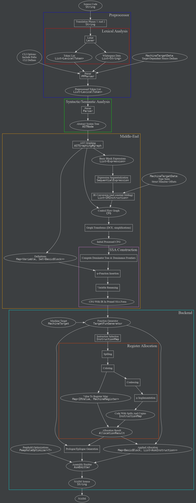
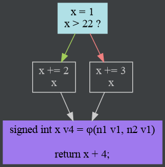
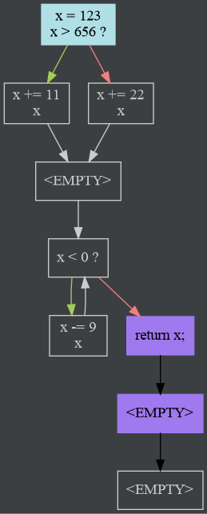
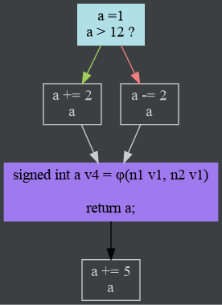

# CKompiler

A C11 compiler written in Kotlin.

This project is just a compiler; the assembler and linker are not implemented,
and are assumed to exist in the environment (eg `nasm` and `ld`).

Run `./gradlew distZip` for the compiler's CLI (will be created in
`build/distributions/ckompiler-$version.zip`).

JUnit tests can be found in the `slak.test` package, in `src/test/kotlin`.

Also, see what was chosen for some
[implementation defined/undefined behaviours][impl_defs].

## The CLI

For an extensive list of options, run `ckompiler --help`.

The command line interface is intended to emulate `gcc`/`clang` where possible.
Many common flags like `-o`, `-c`, `-D`, `-I`, `-l` do exactly what
they're expected to do.

The CLI also supports various debugging options, such as the
`--cfg-mode`-related opts, or the `--print-asm-comm` flag.

The argument parsing is done using [kotlinx.cli][kotlinxcli], along with a bunch
of custom extensions that can be found in [CLIExtensions.kt][cli_exts]. The
actual code that powers the command line can be found in the [CLI][cli] class.

## Overview of implementation details

The compiler is mostly implemented as a processing pipeline of immutable data
structures.

The following graph shows the path code takes through the compiler, from the
source code to the output assembly:
<p align="center"></p>

[(graph source)](readme-resources/compiler-pipeline.dot)

### Interfaces And Delegation

Many components in the compiler are decoupled: they exist as concrete classes
that implement an associated interface. Users of the components are given an
instance of the concrete classes, and they use it to immediately delegate the
associated interfaces.

For example, when the `DeclarationParser` needs to parse an initializer
expression, it implements the `IExpressionParser` interface, and delegates that
job to a concrete `ExpressionParser` instance received through the constructor
(or, in some cases, via `lateinit` properties, to resolve cyclic dependencies).

As a code example, the largest of the components, `StatementParser`, is declared
like this:
```kotlin
class StatementParser(
    declarationParser: DeclarationParser,
    controlKeywordParser: ControlKeywordParser,
    constExprParser: ConstantExprParser
) : IStatementParser,
    ITokenHandler by declarationParser,
    IScopeHandler by declarationParser,
    IParenMatcher by declarationParser,
    IExpressionParser by controlKeywordParser,
    IConstantExprParser by constExprParser,
    IDeclarationParser by declarationParser,
    IControlKeywordParser by controlKeywordParser { /* ... */ }
```
As the code shows, `StatementParser` doesn't receive 7 separate components, even
though it delegates the implementation of 7 different interfaces.
Since the `DeclarationParser` implements some of those interfaces itself,
`StatementParser` only needs an instance of that for all of them.

This approach has several advantages:

1. Components are forced to be written against the exposed interfaces
   (dependency inversion principle), allowing implementation details to be
   hidden in the concrete classes (single responsibility principle).
2. The individual interfaces are simple compared to a monolith approach, where
   every component would have access to every other component (interface
   segregation principle).
3. The dependencies between components are made explicit; for example, a
   `ScopeHandler` has no business using a `ControlKeywordParser`. Requiring
   manual delegation helps prevent accidental coupling.
4. The delegate syntax is clean: there is usually no need to write
   `component.doThing()`, rather `doThing()` can be called directly. This is
   most obvious in parser components using `ITokenHandler`, since they have
   lots (hundreds) of calls to functions like `current`, `eat`, `isEaten` or
   `tokenContext`. Without delegation, they'd end up polluting the source with
   `tokenHandler.current()` everywhere, which is not great for readability.

### Errors

A compiler has to deal with two classes of "errors"; those that come from the
code being compiled ("diagnostics"), and those that signal issues in the
compiler itself.

All the relevant code can be found in the [Diagnostics.kt][diags] file.

###### Diagnostics

Diagnostics are handled by the `DebugHandler` class (and its corresponding
interface, `IDebugHandler`).

Printed diagnostics look like this:

<pre>
someFile.c:1:27: <span style="color: red">error:</span> Expression is not assignable [Parser|EXPRESSION_NOT_ASSIGNABLE]
int main() {int x; (x + 2) = 5;}
                    <span style="color: green">~~~~~  ^</span>    
</pre>

We generate `Diagnostic` instances using a simple DSL, but the error messages,
the source extracts, and the caret/tilde markers are created lazily, internally.
They are only computed when (or if) the diagnostic gets printed. This is useful,
because it makes creating a `Diagnostic` instance relatively cheap. As a result,
we can create diagnostics even if they might be discarded later, with little
cost. One such place where diagnostics are sometimes discarded is
`ConstantExprParser#evaluateExpr`.

An example of the `IDebugHandler.diagnostic` DSL, used in the parser:
```kotlin
// ...
diagnostic {
  id = DiagnosticId.INVALID_ARGUMENT_UNARY
  formatArgs(expr.type, op.op.s)
  errorOn(c..expr)
}
// ...
```
The range passed to `errorOn` in the example above, is an implementor of the
`SourcedRange` interface.

The `rangeTo` operator is overloaded on `SourcedRange`s to easily combine
multiple ranges into one, like in this example from the parser:
```kotlin
sizeOf..tokenAt(rParenIdx)
```
The `sizeOf` token and the token returned by `tokenAt(rParenIdx)` are not
adjacent (think of `sizeof(int)`), but this overload allows the parser to
trivially create a compound `SourcedRange` to cover the entire sizeof
expression.

Since `LexicalToken` and `ASTNode` are implementations of `SourcedRange`,
compound ranges can be created by mixing and matching tokens and AST pieces
(`tok..node` and `node..tok` are both valid syntax).

Another example, used in `sequentialize`:
```kotlin
// ...
diagnostic {
  id = DiagnosticId.UNSEQUENCED_MODS
  formatArgs(variable.name)
  for (mod in modList) when (mod) {
    is BinaryExpression -> errorOn(mod.lhs)
    is IncDecOperation -> errorOn(mod)
    else -> logger.throwICE("Modification doesn't modify anything") { mod }
  }
}
// ...
```
This illustrates the utility provided by using a lambda + builder DSL. Arbitrary
code can run in the construction of the diagnostic, so the same diagnostic can
be tailored to different situations.

Finally, an example from the preprocessor:
```kotlin
// ...
diagnostic {
  id = if (ignoreTrigraphs) DiagnosticId.TRIGRAPH_IGNORED else DiagnosticId.TRIGRAPH_PROCESSED
  if (!ignoreTrigraphs) formatArgs(replacement)
  columns(matchResult.start() until matchResult.end())
}
// ...
```
Even the kind of diagnostic can be dynamically selected based on arbitrary
logic, which makes it easy to support feature flags like `-fno-trigraphs` in
diagnostics.

###### Compiler Errors

For actual issues in the compiler, we use logging (via [Log4j 2][log4j2]), the
`InternalCompilerError` class, the `throwICE` extension methods on logger
instances, and Kotlin's stdlib functions from `Preconditions.kt`. Instances of
ICE, `IllegalArgumentException` or `IllegalStateException` being thrown means
invariants were violated, "impossible" situations occurred, or misuse of an API
was encountered. As a result, these exceptions should not be caught anywhere: it
is desirable for the application to crash if someone threw an ICE. Any one of
these exceptions being thrown is an unfixed bug in the compiler.

Since the compiler is still a work in progress, there are many features/code
paths that are not yet implemented. They generally do not throw ICEs, rather
they use `NotImplementedError`s created by the `TODO` function.

### The `ITokenHandler` Interface

This interface allows a user to interact with a list of `LexicalToken`s. It
provides functions to process a token, move past it to the next one, search for
the first token to meet a condition, or easily get debug data.

The terminology used in this interface's methods relates to "eating" tokens.
Eating a token means it was processed, consumed, or dealt with in some way, and
further calls to the `current` function will return the next available token. As
expected, `isEaten` returns true if there are no more tokens left.

By far the most interesting feature, however, is the `tokenContext` function.
One of the most common operations when parsing is having to create a
"sub-parser" for certain nested data: the contents of a set of parenthesis in
expressions, statement blocks for functions, argument lists for function calls
or function prototypes, and many more.  
The `tokenContext` function takes an end index, and a lambda. A sublist is
created, including the tokens from the current one, to the one specified by the
end index. This is just a view into the larger list of tokens, so no array
copies are made. The lambda is then executed.  
This is how context nesting works in an expression:
```
2 + (6 - 3 * (2 + 2) - ((7 * 7) / 2)) * 5
^^^^^^^^^^^^^^^^^^^^^^^^^^^^^^^^^^^^^^^^^ Root context
2 + (6 - 3 * (2 + 2) - ((7 * 7) / 2)) * 5
     ^^^^^^^^^^^^^^^^^^^^^^^^^^^^^^^      Outer paren's context (1st tier)
2 + (6 - 3 * (2 + 2) - ((7 * 7) / 2)) * 5
              ^^^^^     ^^^^^^^^^^^       Each inner paren has its own context,
                                          but they're at the same "tier", not
                                          nested (2nd tier)
2 + (6 - 3 * (2 + 2) - ((7 * 7) / 2)) * 5 
                         ^^^^^            Finally, the inner-most paren has yet
                                          another context, nested 3 tiers deep
```
Eating tokens in nested contexts advances the parent contexts through them. On
the diagram, eating the `7 * 7` tokens in the inner-most context will advance
all the 3 levels above beyond these tokens (but no further!).

The context's magic lies in the fact that the behaviour of the `ITokenHandler`'s
functions is dynamic based on the token context. For example, if we're parsing
an expression such as `1 + (2 * 3 - 4) - 7`, the parens will get their own
context. Eating tokens (via `eat` or `eatUntil`) in this context will never eat
tokens beyond the contents of the parens. In context, the `isEaten` function
will return true after `4` was eaten, even if there are other tokens afterwards.

Most functions of the interface react to the context. As a result, parsing can
be reasoned about in discrete chunks: each context deals with its own contents,
and does not care what is being parsed in the parent contexts. Let's say an
error is encountered inside a context: `1 + (2 * 3 - ) - 7`. There is a missing
primary expression inside the paren. The expression parser notices, and consumes
all the tokens in the context. However, this does not affect the outer
expression's: the interface provides no way to eat tokens beyond the ones
allocated to the context, accidentally or otherwise.

This interface is used both in the parser, and in the preprocessor.

### Nested Declarator Parsing

Parsing declarators gets very complicated, very fast when nested declarators come
into play. A typical declaration with nested declarators looks like:
```
int * (*f(int x))(double y)
^^^                         declaration specifiers
int * (*f(int x))(double y)
      ^^^^^^^^^^^           nested declarator
int * (*f(int x))(double y)
                 ^^^^^^^^^^ declarator suffix for non-nested declarator
int * (*f(int x))(double y)
         ^^^^^^^            declarator suffix for nested declarator
int * (*f(int x))(double y)
    ^                       indirection that "belongs" to the declaration specifiers
                            (from "int" to "pointer to int")
int * (*f(int x))(double y)
       ^                    indirection that "belongs" to the declarator suffix
                            (from "function" type to "pointer to function" type)
int * (*f(int x))(double y)
        ^                   designator for the resulting declaration
                            (ie the name of the function)
```

The example declaration declares a function called `f`, that takes one int
parameter called `x`, and returns a pointer to a function that also takes one
parameter, a double `y`, and returns a pointer to an int.

Indirection binds in reverse order of suffixes: the first indirection binds to
the last suffix, and the last indirection binds to the first suffix. This
reflects the declarator nesting.

Dereferencing the int pointer returned by calling the returned function pointer,
in one expression, looks like this:
```
int result = *(f(1)(2.0));
```

---

Yes, this is why typedefs exist.

### Front-end

###### Lexer

The [lexer][lexer] operates on the source code string, and produces a list of
[LexicalToken][tokens]s and its subclasses. It is integrated in the
[Preprocessor][pp]. They deal with translation phases 1-6.

###### Parser

The [parser][parser] operates on the token list, and produces an
[abstract syntax tree][ast] of `ASTNode` instances. It also performs type
checks, resolves scope, identifier names and other such semantic requirements.

It is mostly a hand-written recursive descent parser, with a
[precedence climbing][prec_climb] parser integrated for expressions, which can
be found in the [ExpressionParser][expr_parser] class.

Much of the parser is built out of loosely coupled classes that each handle
parts of parsing the grammar (eg [ParenMatcher][paren_matcher] handles
everything about matching parenthesis, [StatementParser][st_parser] parses
function block statements, etc).  
Each of these has an associated interface (`IExpressionParser` for the
`ExpressionParser` class), that is used for delegation.  

### Analysis And IR ("middle-end")

The [analysis][analysis] package takes the syntax tree, and turns each function
into a graph, with nodes that contain a simpler intermediate representation.

###### Control flow

Control flow is resolved by converting the AST to a graph (see
[ASTGraphing.kt][ast_graphing]), where each node (a so-called [BasicBlock][bb])
represents a _linear_ piece of code, with no jumps, conditional or otherwise.
Basically, all `ASTNode` subclasses are removed by the conversion to a graph,
except for `Expression` subclasses (with certain exceptions:
`TernaryConditional`, in particular, is also removed).

Those linear pieces of code are represented as a `List<Expression>`, and are
transformed to the simple IR (`List<IRInstruction>`) while creating the graph
(see [sequentialize][seq] and [createInstructions][ir]).

Constant folding is also applied to the expressions during this process (see
[ConstantFolding.kt][const_fold]).

While creating the graph, various variable declarations are encountered. These
do not show up in the IR; instead, they are tracked in a separate data structure
(see `CFG.definitions`). A "definition" is either a declaration in the C sense,
or assignment to that variable.

Everything is stored in the [CFG (control flow graph)][cfg] class.

###### Graphical representation for CFGs

The CFG can be viewed graphically, via [Graphviz][graphviz]'s `dot`: the
[createGraphviz][cfg_graphviz_create] function can output the `dot` source for a
graph.  
This functionality is also available via the CLI option `--cfg-mode`.

For example, the following code

```C
int main() {
  int x = 1;
  if (x > 22) {
    x += 2;
  } else {
    x += 3;
  }
  return x + 4;
}
```

produces the following graph
<p align="center"></p>

###### SSA form

The `CFG` class is also responsible for converting the code in its nodes to a
(pruned) [SSA form][ssa]. However, the process has a few prerequisites:

1. The CFG must be cleaned of certain artifacts created during AST graphing. In
   particular, empty blocks (blocks with no code, no condition and no return)
   are removed from the graph.
   
   Here is an example of a CFG that has not been cleaned:  
   <p align="center"></p>
   
   All the blocks labeled `<EMPTY>` are redundant.
   
   The edges are collapsed such that the control flow the graph represents is
   unchanged. This is done in a loop until no more collapsing can be done;
   removing an empty block may also allow us to remove a previously
   un-removable block (this case is in the example above, with the two blocks
   that come after the return).
   
   See `collapseEmptyBlocks` in [ControlFlowGraph.kt][cfg], and
   `BasicBlock.collapseEmptyPreds` in [BasicBlock.kt][bb].
2. Dead code elimination is performed, by finding subgraphs disconnected from
   the start node. See `filterReachable` in [ControlFlowGraph.kt][cfg]. 
   
   Note that in this case, impossible edges aren't considered for connectivity.
   For example, a basic block that contains a function return has an impossible
   edge to another basic block, which contains the code after the return.
   Strictly speaking, the second block is connected. For DCE purposes, however,
   such blocks are considered disconnected. Such a graph looks like this:  
   <p align="center"></p>
3. Unterminated `BasicBlock`s are identified. Warnings are reported for non-void
   functions (it means control flow reached the end of the function and didn't
   find a return). The blocks are terminated with an `ImpossibleJump`.
4. We precompute a list of the CFG's nodes in [post-order][post_order]
   (basically DFS, for the kinds of graphs encountered here). See
   `postOrderNodes` in [ControlFlowGraph.kt][cfg].
5. An auxiliary data structure, `DominatorList`, is created. This list stores
   each node's _immediate dominator_. The list is then used to compute every
   node's _dominance frontier_, which is stored as a member of `BasicBlock`.

Once all these steps are complete, SSA conversion can begin. It works in 2
phases: φ-function insertion, and variable renaming.

The first phase is responsible for taking every single variable definition in
the function, and creating `PhiInstruction` instances for every control flow
intersection (this is what the dominance frontier is used for). This is a
relatively uncomplicated process if dominance is precomputed. See
`insertPhiFunctions` in [ControlFlowGraph.kt][cfg].

The second phase does the bulk of the work: renaming every use and definition of
every variable. A lot of state is tracked to enable this process (see the
`ReachingDefinition` and `VariableRenamer` classes in
[ControlFlowGraph.kt][cfg]). The "renaming" is done by simply annotating
variables with a "version" property. "Newer" versions' definitions are strictly
dominated by "older" versions' definitions.

Once this work is completed, the code is now in SSA form.

If the `ControlFlowVariableRenames` marker in [log4j2.xml][log4j2_xml] is
enabled (it is denied logging by default), the variable renamer will print a
table outlining the steps done during renaming for the variable `x`:
```text
[TRACE] in ControlFlow: BB| x mention   | x.reachingDef
[TRACE] in ControlFlow: -------------------------------
[TRACE] in ControlFlow: 1 |     x0 φuse | ⊥ updated into ⊥
[TRACE] in ControlFlow: 1 | def x1      | ⊥ then x1
[TRACE] in ControlFlow: 1 |     x1 use  | x1 updated into ⊥
[TRACE] in ControlFlow: 3 | def x2      | x1 then x2
[TRACE] in ControlFlow: 3 |     x2 use  | x2 updated into x1
[TRACE] in ControlFlow: 9 |     x2 φuse | x2 updated into x1
[TRACE] in ControlFlow: 4 |     x1 use  | x2 updated into ⊥
[TRACE] in ControlFlow: 4 | def x3      | x1 then x3
[TRACE] in ControlFlow: 4 |     x3 use  | x3 updated into x1
[TRACE] in ControlFlow: 4 |     x3 use  | x3 updated into x1
[TRACE] in ControlFlow: 2 |     x3 φuse | x3 updated into x1
[TRACE] in ControlFlow: 9 |     x3 φuse | x3 updated into x1
[TRACE] in ControlFlow: 9 | def x4      | x3 then x4
[TRACE] in ControlFlow: 9 |     x4 use  | x4 updated into x3
[TRACE] in ControlFlow: 9 | def x5      | x4 then x5
[TRACE] in ControlFlow: 9 |     x5 use  | x5 updated into x4
[TRACE] in ControlFlow: 9 |     x5 use  | x5 updated into x4
[TRACE] in ControlFlow: 1 |     x5 φuse | x5 updated into x4
[TRACE] in ControlFlow: 2 |     x5 φuse | x5 updated into x4
[TRACE] in ControlFlow: 2 | def x6      | x5 then x6
[TRACE] in ControlFlow: 2 |     x6 use  | x6 updated into x5
```

(timestamps omitted for brevity)

### Back-end

###### Target-Specific Information

Certain things depend on the target ISA and/or the machine (the size of an
`int`, for example). `MachineTargetData` instances contain all this information.

`MachineTargetData` is also responsible for generating various macros used in
stdlib headers (such as `__PTRDIFF_T_TYPE` for `stddef.h`).

This class is technically part of the backend, but certain features handled in
the front-end (eg `sizeof`) also depend on this target-specific data.

For now, only x64 Linux is supported, but the infrastructure for x86 and other
platforms exists.

###### The `MachineInstruction` class

This class represents an instruction along with its operands (`IRValue`s), so
it is still target-independent. All the target-dependent aspects of the
instruction are contained within the `InstructionTemplate` stored by the MI (see
below for more).

###### The Instruction Graph

A [CFG][cfg] is sufficient to represent the control flow, but in order to more
cleanly separate responsibilities, and to avoid turning the CFG class into a god
object, a new graph representation is introduced, [InstructionGraph][igraph].

This class is the CFG's analogue in the backend (and is actually created by
copying the structure of the existing CFG). Similarly, `InstrBlock` is the
analogue for `BasicBlock`.

`InstrBlock` implements the `MutableList<MachineInstruction>` interface, for
easily interacting with the instructions in a block.

###### The Code Generation Interfaces

These interfaces describe the code generation process in a target-independent
manner. The code can be found in [MachineTarget.kt][machine_target].

1. `MachineTarget`: This interface describes a particular compilation target. It
   contains the relevant `MachineTargetData` instance, and data about the
   register file of the target ISA.
2. `TargetOptions`: Represents the set of CLI options passed to a target.
2. `MachineRegisterClass`: Describes a type of register in the ISA. For example,
   x64 distinguishes between general purpose integer registers (`rax`, `rbp`,
   etc) and SSE/AVX registers (`xmm4`, `ymm1`, etc).
3. `MachineRegister`: A description of a particular register in the ISA. Stores
   size, class, aliases.
4. `TargetFunGenerator`: Implementors of this interface are code generators for
   a single function graph, for a particular `MachineTarget`. An instance of this
   class holds all the state required for all the code generation stages before
   emission.
5. `AsmEmitter`: Takes the result of all the function generators in a
   translation unit and emits the actual assembly string. Currently, this means
   it emits NASM.
6. `PeepholeOptimizer`: Takes a list of `AsmInstruction`s, and optimizes them in
  isolation. Used by `AsmEmitter`s.
7. `InstructionTemplate`: Represents a particular instruction from an ISA. For
   example: `mov r/m64, r64` or `add r32, imm32`.
8. `AsmInstruction`: Final generated instruction, ready for emission.

###### Code Generation Process

First, `TargetFunGenerator`s are created for all the functions in the
translation unit. They are passed to an `AsmEmitter`, which returns the
assembled code. The emitter is the one who triggers the actual generation
process for each function's generator.

Generation starts with instruction selection. Instruction selection creates
`MachineInstruction`s for each block, which are stored in the corresponding
`InstrBlock`. The block has overridden methods for adding to the list: they
also incrementally update the last uses map to account for the operands of the
instruction.

The next step is register allocation. Note that the code is still in SSA form: φ
functions have not been removed, and variables are only assigned once per
version. The register allocator is based on [this paper][hack], and is
target-independent (code in [RegisterAllocation.kt][regalloc]).

The allocator is a graph coloring register allocator (GCRA), but it allocates
directly over SSA. Other GCRAs run an SSA destruction algorithm before
allocation, but this actually introduces additional complexity: the coloring
influences spilling, and coalescing influences both. A graph that is not
k-colorable will have to be rebuilt after a spill. Both coloring and coalescing
will have to run after spills.

Allocation over SSA allows this process to be decoupled: SSA interference graphs
are chordal (also from [here][hack]), so k-colorability can be determined in
polynomial time. That is, register pressure at all labels in the program can be
known beforehand. That information is used to figure out spill locations before
coloring (all labels where the register pressure is higher than the available
registers). The resulting graph can be then colored (also in polynomial time),
and it is guaranteed that coloring will not fail, because we forcefully reduced
the chromatic number via spilling. Coalescing runs after coloring, but before
implementing φs.

The register allocator alters the blocks of the `InstructionGraph`. Copies
and/or spills are inserted, even new blocks might be inserted. The allocator also
produces a list of spilled variables, as well its primary purpose, the actual
allocation of registers to variables/temporaries.

After this is done, the function generator creates the function
prologue/epilogue, and the final `AsmInstruction`s by replacing `IRValue`s with
actual registers and memory locations.

Finally, the `AsmEmitter` emit the actual assembly from the `AsmInstruction`s
passed from the generator.

###### `--mi-debug` mode

Like the `--cfg-mode` option above, the backend has a debugging option.
By default, it prints the code at various execution points
(`MachineInstruction`s, `InstrBlock`s and/or `AsmInstruction`s). It also prints
the list of allocations made, and all the allocation violations.

The `--mi-html` prints this information in pretty HTML instead:
[example](readme-resources/example-mi-debug.html). 

### References

The documentation in the code makes references to some of these documents,
especially to the C standard.

- [C11 draft standard][std_draft]
- [SSA book][ssa_book]
- [System V ABI][sysVabi]
- [NASM documentation][nasm]
- [x86_64 calling conventions][x64calling]
- [Intel 64 ISA reference][intel64isa]
- [A simple, fast dominance algorithm, Cooper et al][dom_algo]
- [Register Allocation for Programs in SSA Form, Sebastian Hack][hack]
- [Computing Liveness Sets for SSA-Form Programs, Brander et al][liveness_sets]
- [Register Spilling and Live-Range Splitting for SSA-Form Programs, Braun & Hack][spilling_ref]

[impl_defs]: ./ListOfBehaviours.md
[log4j2_xml]: ./src/main/resources/log4j2.xml
[lexer]: ./src/main/kotlin/slak/ckompiler/lexer/LexicalElements.kt
[pp]: ./src/main/kotlin/slak/ckompiler/lexer/Preprocessor.kt
[tokens]: ./src/main/kotlin/slak/ckompiler/lexer/TokenModel.kt
[parser]: ./src/main/kotlin/slak/ckompiler/parser/
[ast]: ./src/main/kotlin/slak/ckompiler/parser/SyntaxTreeModel.kt
[expr_parser]: ./src/main/kotlin/slak/ckompiler/parser/ExpressionParser.kt
[paren_matcher]: ./src/main/kotlin/slak/ckompiler/parser/ParenMatcher.kt
[st_parser]: ./src/main/kotlin/slak/ckompiler/parser/StatementParser.kt
[analysis]: ./src/main/kotlin/slak/ckompiler/analysis/
[ast_graphing]: ./src/main/kotlin/slak/ckompiler/analysis/ASTGraphing.kt
[bb]: ./src/main/kotlin/slak/ckompiler/analysis/BasicBlock.kt
[seq]: ./src/main/kotlin/slak/ckompiler/analysis/Sequentialization.kt
[ir]: ./src/main/kotlin/slak/ckompiler/analysis/IRBuilderContext.kt
[cfg]: ./src/main/kotlin/slak/ckompiler/analysis/ControlFlowGraph.kt
[const_fold]: ./src/main/kotlin/slak/ckompiler/analysis/ConstantFolding.kt
[diags]: ./src/main/kotlin/slak/ckompiler/Diagnostics.kt
[cli]: ./src/main/kotlin/slak/ckompiler/CLI.kt
[cli_exts]: ./src/main/kotlin/slak/ckompiler/CLIExtensions.kt
[cfg_graphviz_create]: ./src/main/kotlin/slak/ckompiler/analysis/CFGGraphviz.kt
[ssa]: https://en.wikipedia.org/wiki/Static_single_assignment_form
[graphviz]: https://www.graphviz.org/
[intel64isa]:
https://www.intel.com/content/dam/www/public/us/en/documents/manuals/64-ia-32-architectures-software-developer-instruction-set-reference-manual-325383.pdf
[x64calling]:
https://en.wikipedia.org/wiki/X86_calling_conventions#x86-64_calling_conventions
[sysVabi]: https://www.uclibc.org/docs/psABI-x86_64.pdf
[dom_algo]: https://www.cs.rice.edu/~keith/EMBED/dom.pdf
[nasm]: https://nasm.us/doc/nasmdoc0.html
[ssa_book]: http://ssabook.gforge.inria.fr/latest/book.pdf
[log4j2]: https://logging.apache.org/log4j/2.x/
[post_order]: https://en.wikipedia.org/wiki/Tree_traversal#Post-order_(LRN)
[prec_climb]:
https://en.wikipedia.org/wiki/Operator-precedence_parser#Precedence_climbing_method
[std_draft]: http://www.open-std.org/jtc1/sc22/wg14/www/docs/n1570.pdf
[kotlinxcli]: https://github.com/Kotlin/kotlinx.cli
[hack]: https://publikationen.bibliothek.kit.edu/1000007166/6532
[machine_target]: ./src/main/kotlin/slak/ckompiler/backend/MachineTarget.kt
[regalloc]: ./src/main/kotlin/slak/ckompiler/backend/RegisterAllocation.kt
[igraph]: ./src/main/kotlin/slak/ckompiler/backend/InstructionGraph.kt
[liveness_sets]: https://hal.inria.fr/inria-00558509/
[spilling_ref]: https://link.springer.com/content/pdf/10.1007/978-3-642-00722-4_13.pdf
