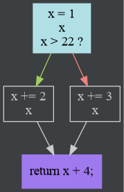

.. include:: _config.rst

Middle-end (Analysis and IR)
==============================

The `analysis`_ package takes the syntax tree, and turns each function into a graph, with nodes that contain a simpler
intermediate representation.

Control Flow
------------

Control flow is resolved by converting the AST to a graph (see `ASTGraphing.kt`_), where each node (a so-called
`Basic Block`_) represents a *linear* piece of code, with no jumps, conditional or otherwise.
Basically, all `ASTNode` subclasses are removed by the conversion to a graph, except for `Expression` subclasses
(with certain exceptions: `TernaryConditional`, in particular, is also removed).

Those linear pieces of code are represented as a `List<Expression>`, and are transformed to the simple IR
(`List<IRInstruction>`) while creating the graph (see `sequentialize`_ and `createInstructions`_).

While creating the graph, various variable declarations are encountered.
These do not show up in the IR; instead, they are tracked in a separate data structure (see `CFG.definitions`).
A "definition" is either a declaration in the C sense, or assignment to that variable.

Everything is stored in the `CFG`_ class.

.. _analysis: https://github.com/slak44/ckompiler/tree/master/src/main/kotlin/slak/ckompiler/analysis/
.. _ASTGraphing.kt:
   https://github.com/slak44/ckompiler/tree/master/src/main/kotlin/slak/ckompiler/analysis/ASTGraphing.kt
.. _Basic Block: https://github.com/slak44/ckompiler/tree/master/src/main/kotlin/slak/ckompiler/analysis/BasicBlock.kt
.. _sequentialize:
   https://github.com/slak44/ckompiler/tree/master/src/main/kotlin/slak/ckompiler/analysis/Sequentialization.kt
.. _createInstructions:
   https://github.com/slak44/ckompiler/tree/master/src/main/kotlin/slak/ckompiler/analysis/IRBuilderContext.kt
.. _CFG: https://github.com/slak44/ckompiler/tree/master/src/main/kotlin/slak/ckompiler/analysis/ControlFlowGraph.kt

JSON serialization
^^^^^^^^^^^^^^^^^^

The CFG (including BasicBlocks, and the IR) are serializable to JSON, using the CLI options `--cfg-mode --export-cfg`.

Here's a sample of a JSON BasicBlock:

.. code-block:: json

  {
    "isRoot": false,
    "phi": [],
    "ir": [
      {
        "discriminator": "slak.ckompiler.analysis.IntBinary",
        "result": {
          "discriminator": "slak.ckompiler.analysis.VirtualRegister",
          "registerId": 2,
          "type": "signed int"
        },
        "op": "SUB",
        "lhs": {
          "discriminator": "slak.ckompiler.analysis.Variable",
          "type": "signed int",
          "name": "second",
          "identityId": 2,
          "version": 1
        },
        "rhs": {
          "discriminator": "slak.ckompiler.analysis.IntConstant",
          "value": 22,
          "type": "signed int"
        }
      },
      {
        "discriminator": "slak.ckompiler.analysis.MoveInstr",
        "result": {
          "discriminator": "slak.ckompiler.analysis.Variable",
          "type": "signed int",
          "name": "second",
          "identityId": 2,
          "version": 2
        },
        "value": {
          "discriminator": "slak.ckompiler.analysis.VirtualRegister",
          "registerId": 2,
          "type": "signed int"
        }
      }
    ],
    "postOrderId": 9,
    "nodeId": 2,
    "predecessors": [0],
    "successors": [4],
    "terminator": {
      "discriminator": "slak.ckompiler.analysis.UncondJump",
      "target": 4
    }
  }

Graphical representation for CFGs
^^^^^^^^^^^^^^^^^^^^^^^^^^^^^^^^^

.. _createGraphviz:
   https://github.com/slak44/ckompiler/tree/master/src/main/kotlin/slak/ckompiler/analysis/CFGGraphviz.kt

The CFG can be viewed graphically, via `Graphviz <https://www.graphviz.org/>`_'s `dot`: the `createGraphviz`_ function
can output the `dot` source for a graph.
This functionality is available via the CLI option `--cfg-mode`, or via the
`Internals Explorer <https://slak44.github.io/ckompiler/>`_ app in a browser.

For example, the following code

.. code-block:: C

  int main() {
    int x = 1;
    if (x > 22) {
      x += 2;
    } else {
      x += 3;
    }
    return x + 4;
  }

produces the following graph

.. include:: ssa.rst
